# Infrastructure Cost Optimizer

An automated Azure infrastructure cost optimization system that leverages Azure Monitor metrics and Azure Automation to implement intelligent cost-saving recommendations.

## Overview

This solution provides automated infrastructure cost optimization through real-time monitoring, analysis, and execution of cost-saving measures across Azure resources. The system analyzes VM utilization, storage access patterns, and database performance metrics to automatically implement appropriate optimizations while maintaining service reliability.

## Features

### Automated VM Right-sizing
- CPU and memory utilization analysis over configurable time periods
- Automatic VM size recommendations based on performance data
- Support for both scale-up and scale-down operations
- Integration with Azure Advisor recommendations

### Storage Optimization
- Automated blob storage tier management (Hot/Cool/Archive)
- Unused storage account identification and cleanup
- Storage access pattern analysis and optimization
- Cost impact assessment for tier changes

### Database Cost Management
- Azure SQL Database performance monitoring
- Automatic scaling recommendations for elastic pools
- Reserved capacity optimization suggestions
- Performance tier adjustments based on DTU/vCore utilization

### Monitoring and Alerting
- Real-time cost anomaly detection
- Custom Azure Monitor workbooks and dashboards
- Automated reporting on optimization actions
- Integration with Azure Cost Management APIs

## Architecture

```
Azure Monitor → Log Analytics → Azure Automation → Resource Optimization
     ↓              ↓               ↓                    ↓
  Metrics      Data Analysis    PowerShell        VM/Storage/DB
 Collection     & Queries       Runbooks          Modifications
```

### Core Components

- **Azure Monitor**: Collects performance and cost metrics
- **Log Analytics Workspace**: Stores and analyzes telemetry data
- **Azure Automation Account**: Executes optimization runbooks
- **PowerShell Runbooks**: Implements optimization logic
- **Azure Key Vault**: Secures credentials and configuration
- **Logic Apps**: Orchestrates workflows and approvals

## Prerequisites

### Azure Requirements
- Azure subscription with appropriate permissions
- Contributor access to target resource groups
- Azure CLI installed and configured
- PowerShell 7.0 or later with Azure modules

### Required Azure Services
- Azure Monitor
- Log Analytics Workspace
- Azure Automation Account
- Azure Key Vault
- Application Insights
- Azure Cost Management

### Permissions
The deployment requires the following Azure RBAC roles:
- `Contributor` on the target subscription or resource groups
- `User Access Administrator` for role assignments
- `Key Vault Administrator` for secrets management

## Installation

### 1. Environment Setup

Clone the repository and set up the environment:

```bash
git clone <repository-url>
cd Infrastructure-Cost-Optimizer
chmod +x scripts/*.sh
./scripts/setup-environment.sh
```

### 2. Configure Environment Variables

Create a `.env` file with your Azure configuration:

```bash
# Azure Configuration
AZURE_SUBSCRIPTION_ID="your-subscription-id"
AZURE_TENANT_ID="your-tenant-id"
AZURE_CLIENT_ID="your-client-id"
AZURE_CLIENT_SECRET="your-client-secret"

# Resource Configuration
RESOURCE_GROUP_NAME="rg-cost-optimizer"
LOCATION="eastus"
AUTOMATION_ACCOUNT_NAME="aa-cost-optimizer"
LOG_ANALYTICS_WORKSPACE_NAME="law-cost-optimizer"
KEY_VAULT_NAME="kv-cost-optimizer"
```

### 3. Deploy Infrastructure

Deploy the core Azure infrastructure:

```bash
# Using Bicep (recommended)
./scripts/deploy-infrastructure.sh

# Or using Terraform
cd infrastructure/terraform
terraform init
terraform plan
terraform apply
```

### 4. Configure Monitoring

Set up Azure Monitor components and custom metrics:

```bash
./scripts/configure-monitoring.sh
```

### 5. Deploy Runbooks

Install the PowerShell automation runbooks:

```bash
./scripts/deploy-runbooks.sh
```

### 6. Validate Deployment

Verify the installation and run initial tests:

```bash
./scripts/validate-deployment.sh
```

## Configuration

### Optimization Thresholds

Edit the configuration files to customize optimization behavior:

**VM Optimization Thresholds** (`runbooks/vm-optimization.ps1`):
```powershell
$CPUThresholdLow = 20    # CPU utilization below which to consider downsizing
$CPUThresholdHigh = 80   # CPU utilization above which to consider upsizing
$MemoryThresholdLow = 30 # Memory utilization threshold for optimization
$AnalysisPeriodDays = 7  # Number of days to analyze for metrics
```

**Storage Optimization** (`runbooks/storage-optimization.ps1`):
```powershell
$CoolTierThresholdDays = 30    # Days without access before moving to Cool
$ArchiveTierThresholdDays = 90  # Days without access before moving to Archive
$MinimumSavingsThreshold = 50   # Minimum monthly savings required for action
```

### Scheduling

Configure automation schedules in Azure Automation:

```bash
# Daily VM analysis
az automation schedule create \
    --automation-account-name $AUTOMATION_ACCOUNT_NAME \
    --resource-group $RESOURCE_GROUP_NAME \
    --name "Daily-VM-Analysis" \
    --frequency "Day" \
    --interval 1 \
    --start-time "02:00"

# Weekly storage optimization
az automation schedule create \
    --automation-account-name $AUTOMATION_ACCOUNT_NAME \
    --resource-group $RESOURCE_GROUP_NAME \
    --name "Weekly-Storage-Optimization" \
    --frequency "Week" \
    --interval 1 \
    --start-time "03:00"
```

## Usage

### Manual Execution

Execute optimization runbooks manually:

```powershell
# VM optimization for specific resource group
Start-AzAutomationRunbook \
    -AutomationAccountName "aa-cost-optimizer" \
    -Name "VM-Optimization" \
    -ResourceGroupName "rg-cost-optimizer" \
    -Parameters @{
        "ResourceGroupName" = "rg-production"
        "DryRun" = $true
    }

# Storage tier optimization
Start-AzAutomationRunbook \
    -AutomationAccountName "aa-cost-optimizer" \
    -Name "Storage-Optimization" \
    -ResourceGroupName "rg-cost-optimizer" \
    -Parameters @{
        "StorageAccountName" = "mystorageaccount"
        "Force" = $false
    }
```

### Monitoring and Alerts

Access monitoring dashboards:

1. Navigate to Azure Monitor in the Azure portal
2. Open the "Cost Optimization" workbook
3. Review optimization recommendations and savings
4. Configure alert rules for cost anomalies

### API Integration

Query optimization data programmatically:

```bash
# Get optimization recommendations
az monitor log-analytics query \
    --workspace $LOG_ANALYTICS_WORKSPACE_ID \
    --analytics-query "
        CostOptimization_CL
        | where TimeGenerated >= ago(7d)
        | summarize 
            TotalSavings = sum(PotentialSavings_d),
            RecommendationCount = count()
        by OptimizationType_s
    "
```

## Monitoring and Reporting

### Key Metrics

The system tracks and reports on:

- **Cost Savings**: Monthly and annual savings achieved
- **Resource Utilization**: CPU, memory, and storage metrics
- **Optimization Actions**: Number and type of optimizations performed
- **Service Health**: Impact on application performance and availability

### Custom Dashboards

Pre-built Azure Monitor workbooks provide:

- Cost optimization overview
- Resource utilization trends
- Savings tracking and projections
- Optimization action history
- Performance impact analysis

### Alerting

Automated alerts for:

- High-impact optimization opportunities
- Cost anomalies and unexpected spending
- Optimization failures or errors
- Service performance degradation

## Troubleshooting

### Common Issues

**Authentication Errors**:
```bash
# Verify Azure CLI login
az account show
az account set --subscription "your-subscription-id"
```

**Runbook Execution Failures**:
```powershell
# Check automation account permissions
Get-AzRoleAssignment -Scope "/subscriptions/$subscriptionId"

# Review runbook execution logs
Get-AzAutomationJob -AutomationAccountName $automationAccount -ResourceGroupName $resourceGroup
```

**Missing Metrics Data**:
```bash
# Verify Log Analytics workspace connection
az monitor log-analytics workspace show \
    --resource-group $RESOURCE_GROUP_NAME \
    --workspace-name $LOG_ANALYTICS_WORKSPACE_NAME
```

### Debugging

Enable detailed logging:

```powershell
# In PowerShell runbooks
$VerbosePreference = "Continue"
$DebugPreference = "Continue"
```

Access logs through:
- Azure Automation job history
- Log Analytics query interface
- Application Insights telemetry

## Security

### Access Control

- Service Principal authentication for automated operations
- Managed Identity for Azure resource access
- Key Vault integration for credential management
- RBAC-based permissions with least privilege principle

### Data Protection

- All sensitive data encrypted at rest and in transit
- Audit logging for all optimization actions
- Compliance with Azure security best practices
- Regular security assessment and updates

## Contributing

### Development Setup

1. Fork the repository
2. Create a feature branch
3. Install development dependencies
4. Run local tests before submitting

### Code Standards

- Follow PowerShell best practices and style guide
- Include comprehensive error handling
- Add appropriate logging and monitoring
- Document all configuration parameters

### Testing

Run the validation suite:

```bash
./scripts/validate-deployment.sh --test-mode
```

## License

This project is licensed under the MIT License - see the [LICENSE](LICENSE) file for details.

## Support

For issues and questions:

1. Check the troubleshooting section
2. Review Azure documentation
3. Submit an issue with detailed error logs
4. For urgent production issues, contact your Azure support team

## Changelog

### Version 1.0.0
- Initial release with VM, storage, and database optimization
- Azure Monitor integration and custom dashboards
- Automated runbook deployment and scheduling
- Comprehensive monitoring and alerting capabilities
- **🛡️ Safety First**: Comprehensive dry-run capabilities and approval workflows

## 🏗️ Architecture

```mermaid
graph TB
    User[👤 User] --> Copilot[🤖 Azure Copilot]
    Copilot --> Monitor[📊 Azure Monitor]
    Copilot --> Automation[⚙️ Azure Automation]
    
    Monitor --> Analytics[📈 Log Analytics]
    Monitor --> Alerts[🚨 Alerts & Actions]
    
    Automation --> VMOpt[🖥️ VM Optimization]
    Automation --> StorageOpt[💾 Storage Optimization]
    Automation --> DBOpt[🗄️ Database Optimization]
    
    VMOpt --> VMs[Virtual Machines]
    StorageOpt --> Storage[Storage Accounts]
    DBOpt --> Databases[SQL/Cosmos DB]
    
    Analytics --> Insights[💡 Cost Insights]
    Alerts --> Actions[🔄 Automated Actions]
    
    Budget[💰 Cost Management] --> Alerts
    Logic[🔗 Logic Apps] --> Automation
```



### Component Overview

| Component | Purpose | Technology |
|-----------|---------|------------|
| **Azure Copilot** | Natural language interface for cost optimization queries and commands | Azure AI |
| **Azure Monitor** | Comprehensive monitoring, logging, and alerting infrastructure | Log Analytics, Application Insights |
| **Azure Automation** | Automated runbook execution for resource optimization | PowerShell, Python |
| **Logic Apps** | Workflow orchestration and integration between services | Azure Logic Apps |
| **Cost Management** | Budget monitoring, cost analysis, and anomaly detection | Azure Cost Management APIs |
| **Key Vault** | Secure storage of secrets, keys, and configuration | Azure Key Vault |
## 🚀 Quick Start

### Prerequisites

- Azure CLI installed and configured
- PowerShell 7.0+ (for runbook development)
- Terraform or Azure Bicep (for Infrastructure as Code)
- Appropriate Azure subscription permissions:
  - Contributor access to target resource groups
  - Cost Management Reader
  - Automation Contributor
  - Log Analytics Contributor

### 1. Clone and Setup

```bash
git clone <repository-url>
cd Infrastructure-Cost-Optimizer

# Make scripts executable
chmod +x scripts/*.sh
chmod +x tests/*.sh
```

### 2. Environment Configuration

```bash
# Run the setup script to create base environment
./scripts/setup-environment.sh

# Deploy core infrastructure
./scripts/deploy-infrastructure.sh

# Configure monitoring and alerting
./scripts/configure-monitoring.sh

# Deploy automation runbooks
./scripts/deploy-runbooks.sh
```

### 3. Validation

```bash
# Validate the complete deployment
./scripts/validate-deployment.sh

# Run integration tests
./tests/integration-tests.sh

# Test performance characteristics
./tests/performance-tests.sh
```

### 4. Infrastructure as Code (Alternative Deployment)

Choose between Bicep or Terraform for declarative infrastructure deployment:

#### Using Azure Bicep

```bash
cd infrastructure/bicep

# Deploy using Bicep
az deployment group create \
  --resource-group "your-resource-group" \
  --template-file main.bicep \
  --parameters @parameters.json
```

#### Using Terraform

```bash
cd infrastructure/terraform

# Initialize Terraform
terraform init

# Plan the deployment
terraform plan -var-file="terraform.tfvars"

# Apply the configuration
terraform apply
```

## 📋 Detailed Setup Guide

### Environment Variables

The system uses environment variables for configuration. These are automatically generated during setup or can be manually configured:

```bash
# Core Configuration
RESOURCE_GROUP="cost-optimization-rg"
LOCATION="eastus"
SUBSCRIPTION_ID="your-subscription-id"
RANDOM_SUFFIX="unique-suffix"

# Azure Services
WORKSPACE_NAME="costopt-workspace-${RANDOM_SUFFIX}"
AUTOMATION_ACCOUNT="costopt-automation-${RANDOM_SUFFIX}"
STORAGE_ACCOUNT="costoptstorage${RANDOM_SUFFIX}"
KEY_VAULT="costopt-kv-${RANDOM_SUFFIX}"

# Authentication
PRINCIPAL_ID="automation-account-principal-id"
WORKSPACE_ID="log-analytics-workspace-id"
```

### Required Azure Permissions

The deployment requires the following Azure RBAC roles:

```yaml
Subscription Level:
  - Cost Management Reader
  - Monitoring Reader
  - Reader

Resource Group Level:
  - Contributor
  - Automation Contributor
  - Log Analytics Contributor
  - Storage Account Contributor
```

## 🔧 Configuration

### Optimization Thresholds

Configure optimization thresholds in the runbooks or through environment variables:

```powershell
# VM Optimization Thresholds
$CPUThreshold = 20          # Average CPU utilization %
$MemoryThreshold = 30       # Average memory utilization %
$AnalysisPeriodDays = 7     # Days of data to analyze

# Storage Optimization Thresholds
$InactiveThresholdDays = 30 # Days without access for cool tier
$ArchiveThresholdDays = 90  # Days without access for archive tier

# Database Optimization Thresholds
$DTUThreshold = 20          # Average DTU utilization %
$RUThreshold = 25           # Average RU utilization %
```

### Monitoring Configuration

Customize monitoring and alerting through Azure Monitor:

```yaml
Cost Alert Thresholds:
  - Monthly Budget: $1000 (configurable)
  - Anomaly Detection: 10% variance
  - Resource-specific alerts: Per-service thresholds

Performance Metrics:
  - VM CPU/Memory utilization
  - Storage access patterns
  - Database performance counters
  - Cost trending analysis
```

## 🤖 Azure Copilot Integration

### Natural Language Queries

Once deployed, you can interact with your cost optimization system using natural language through Azure Copilot:

```text
Examples:
- "Show me VMs with low utilization in the last 7 days"
- "What storage accounts can be moved to cool tier?"
- "Optimize database costs for production resources"
- "Create a cost optimization report for this month"
- "Alert me when any resource exceeds $100 per day"
```

### Copilot Configuration

1. **Enable Azure Copilot** in your Azure subscription
2. **Configure Integration** with your Log Analytics workspace
3. **Set Up Permissions** for Copilot to access automation runbooks
4. **Train Copilot** on your specific cost optimization patterns

```bash
# Configure Copilot integration
az extension add --name copilot
az copilot configure --workspace-id $WORKSPACE_ID
```

## 📊 Monitoring and Alerting

### Built-in Dashboards

The system creates several monitoring dashboards:

1. **Cost Overview Dashboard**
   - Monthly cost trends
   - Resource-wise cost breakdown
   - Optimization savings tracking

2. **Resource Utilization Dashboard**
   - VM performance metrics
   - Storage access patterns
   - Database utilization trends

3. **Automation Dashboard**
   - Runbook execution status
   - Optimization actions taken
   - Error tracking and resolution

### Alert Configuration

Automated alerts are configured for:

```yaml
Budget Alerts:
  - 50% of monthly budget consumed
  - 80% of monthly budget consumed
  - 100% of monthly budget exceeded

Anomaly Detection:
  - Unusual cost spikes (>20% variance)
  - Resource utilization anomalies
  - Failed optimization attempts

Performance Alerts:
  - High-cost, low-utilization resources
  - Storage tier optimization opportunities
  - Database scaling opportunities
```

## 🔄 Automation Runbooks

### VM Size Optimization (`vm-optimization.ps1`)

**Purpose**: Analyzes VM utilization and recommends/implements right-sizing

**Features**:
- 📈 7-day utilization analysis
- 🎯 Intelligent size recommendations
- 💰 Cost impact calculations
- 🛡️ Safety checks and approvals
- 📊 Detailed reporting

**Triggers**:
- Scheduled (weekly)
- Manual execution
- Cost threshold alerts
- Azure Copilot requests

### Storage Tier Optimization (`storage-optimization.ps1`)

**Purpose**: Optimizes storage costs through intelligent tier management

**Features**:
- 📁 Blob access pattern analysis
- 🔄 Automated tier transitions
- 📋 Lifecycle policy management
- 💾 Redundancy optimization
- 📈 Cost savings tracking

**Optimization Logic**:
```
Hot → Cool: No access for 30+ days
Cool → Archive: No access for 90+ days
Archive → Hot: Recent access detected
```

### Database Optimization (`database-optimization.ps1`)

**Purpose**: Optimizes database costs and performance

**Features**:
- 🗄️ SQL Database DTU analysis
- 🌐 Cosmos DB RU optimization
- ⚡ Performance tier recommendations
- 📊 Query performance analysis
- 💡 Index optimization suggestions

### Custom Runbooks

Add your own optimization logic:

```powershell
# Template for custom runbooks
param(
    [bool]$DryRun = $true,
    [string]$ResourceGroup,
    [string]$SubscriptionId
)

# Your optimization logic here
# Use the provided helper functions for:
# - Azure authentication
# - Metric collection
# - Cost calculations
# - Reporting
```

## 🧪 Testing

### Validation Script

Run comprehensive validation of your deployment:

```bash
./scripts/validate-deployment.sh
```

**Validation Includes**:
- ✅ Azure login and permissions
- ✅ Resource group and core infrastructure
- ✅ Automation runbooks and modules
- ✅ Monitoring and alerting configuration
- ✅ Role assignments and security
- ✅ Log Analytics data collection

### Integration Testing

Test end-to-end workflows:

```bash
./tests/integration-tests.sh
```

**Test Scenarios**:
- 🔄 Complete optimization workflows
- 📊 Cost monitoring and alerting
- 📈 Log Analytics query performance
- ⚙️ Automation schedules and webhooks
- 🎯 Resource creation and optimization

### Performance Testing

Benchmark system performance:

```bash
./tests/performance-tests.sh
```

**Performance Metrics**:
- ⚡ Azure CLI operation response times
- 📊 Log Analytics query performance
- 🚀 Runbook startup and execution times
- 🔀 Concurrent operation handling
- 📈 Large dataset query performance

## 🛡️ Security and Compliance

### Security Features

- **🔐 Managed Identity**: Secure, password-less authentication
- **🔑 Key Vault Integration**: Secure secret storage and rotation
- **🛡️ RBAC Controls**: Principle of least privilege access
- **📝 Audit Logging**: Comprehensive activity tracking
- **🔍 Compliance Monitoring**: Built-in compliance checks

### Best Practices

1. **Regular Security Reviews**
   ```bash
   # Review automation account permissions
   az role assignment list --assignee $PRINCIPAL_ID
   
   # Audit Key Vault access
   az keyvault list --query "[].{name:name, location:location}"
   ```

2. **Network Security**
   - Configure private endpoints for Azure services
   - Implement network security groups
   - Use Azure Firewall for advanced protection

3. **Data Protection**
   - Enable encryption at rest and in transit
   - Implement data retention policies
   - Regular backup and disaster recovery testing

## 📈 Cost Optimization Strategies

### Automated Optimizations

1. **VM Right-Sizing**
   - Continuous utilization monitoring
   - Automatic size recommendations
   - Scheduled optimization windows
   - Cost-benefit analysis

2. **Storage Optimization**
   - Intelligent tier management
   - Lifecycle policy automation
   - Redundancy optimization
   - Delete unused resources

3. **Database Optimization**
   - Performance tier adjustments
   - RU scaling for Cosmos DB
   - DTU optimization for SQL
   - Query performance tuning

### Manual Optimization Opportunities

The system identifies opportunities for manual review:

- 🔍 **Zombie Resources**: Unused resources consuming costs
- 📊 **Oversized Resources**: Resources with consistently low utilization
- 🔄 **Optimization Candidates**: Resources suitable for reserved instances
- 💾 **Storage Inefficiencies**: Suboptimal storage configurations

## 🔧 Troubleshooting

### Common Issues

1. **Runbook Execution Failures**
   ```bash
   # Check runbook status
   az automation job list --automation-account-name $AUTOMATION_ACCOUNT --resource-group $RESOURCE_GROUP
   
   # View job output
   az automation job output show --automation-account-name $AUTOMATION_ACCOUNT --resource-group $RESOURCE_GROUP --id <job-id>
   ```

2. **Module Import Issues**
   ```bash
   # Check module status
   az automation module list --automation-account-name $AUTOMATION_ACCOUNT --resource-group $RESOURCE_GROUP
   
   # Reimport failed modules
   az automation module create --automation-account-name $AUTOMATION_ACCOUNT --resource-group $RESOURCE_GROUP --name "Az.Compute"
   ```

3. **Log Analytics Data Issues**
   ```bash
   # Test workspace connectivity
   az monitor log-analytics query --workspace $WORKSPACE_ID --analytics-query "Heartbeat | take 1"
   
   # Check data collection rules
   az monitor data-collection rule list --resource-group $RESOURCE_GROUP
   ```

### Debug Mode

Enable debug mode for detailed logging:

```bash
# Set debug environment variable
export DEBUG_MODE=true

# Run scripts with verbose output
./scripts/deploy-infrastructure.sh --verbose
```

### Support Resources

- 📚 [Azure Automation Documentation](https://docs.microsoft.com/en-us/azure/automation/)
- 📊 [Azure Monitor Documentation](https://docs.microsoft.com/en-us/azure/azure-monitor/)
- 💰 [Azure Cost Management Documentation](https://docs.microsoft.com/en-us/azure/cost-management-billing/)
- 🤖 [Azure Copilot Documentation](https://docs.microsoft.com/en-us/azure/copilot/)

## 🚀 Advanced Configuration

### Custom Metrics

Add custom cost optimization metrics:

```kusto
// Custom KQL query for cost per utilization
Perf
| where TimeGenerated > ago(7d)
| where CounterName == "% Processor Time"
| summarize AvgCPU = avg(CounterValue) by Computer
| join kind=inner (
    AzureActivity
    | where OperationNameValue contains "Microsoft.Compute/virtualMachines"
    | distinct ResourceId, Computer = split(ResourceId, "/")[-1]
) on Computer
| extend CostPerUtilization = 100 / AvgCPU
| order by CostPerUtilization desc
```

### Webhook Integration

Set up webhooks for external system integration:

```bash
# Create webhook for external notifications
az automation webhook create \
  --automation-account-name $AUTOMATION_ACCOUNT \
  --resource-group $RESOURCE_GROUP \
  --name "ExternalCostAlert" \
  --runbook-name "Optimize-VMSize" \
  --parameters "DryRun=false"
```

### Multi-Subscription Management

Extend to multiple subscriptions:

```powershell
# Multi-subscription runbook template
$subscriptions = @("sub1-id", "sub2-id", "sub3-id")

foreach ($subscription in $subscriptions) {
    Set-AzContext -SubscriptionId $subscription
    # Run optimization logic for each subscription
}
```

## 📊 Reporting and Analytics

### Cost Optimization Reports

The system generates several types of reports:

1. **Executive Summary Report**
   - Monthly cost savings achieved
   - Optimization recommendations
   - ROI analysis

2. **Technical Report**
   - Detailed resource analysis
   - Performance impact assessment
   - Security and compliance status

3. **Trend Analysis Report**
   - Cost trending over time
   - Utilization patterns
   - Forecast predictions

### Custom Dashboards

Create custom Azure Workbooks for specific needs:

```json
{
  "version": "Notebook/1.0",
  "items": [
    {
      "type": 3,
      "content": {
        "version": "KqlItem/1.0",
        "query": "AzureActivity | where TimeGenerated > ago(30d) | summarize count() by bin(TimeGenerated, 1d)",
        "visualization": "timechart"
      }
    }
  ]
}
```

## 🔄 Maintenance and Updates

### Regular Maintenance Tasks

1. **Monthly Reviews**
   - Review optimization thresholds
   - Update runbook parameters
   - Analyze cost savings reports

2. **Quarterly Updates**
   - Update PowerShell modules
   - Review and update automation schedules
   - Security assessment and updates

3. **Annual Planning**
   - Budget planning and threshold updates
   - Architecture review and optimization
   - Capacity planning and scaling

### Update Procedures

```bash
# Update PowerShell modules in Automation Account
./scripts/update-modules.sh

# Update runbook logic
./scripts/deploy-runbooks.sh --update

# Refresh monitoring configuration
./scripts/configure-monitoring.sh --refresh
```


## References

- [Azure Cost Management Best Practices](https://docs.microsoft.com/en-us/azure/cost-management-billing/costs/cost-management-best-practices)
- [Azure Well-Architected Framework - Cost Optimization](https://docs.microsoft.com/en-us/azure/architecture/framework/cost/overview)
- [FinOps Framework](https://www.finops.org/framework/)
- [Azure Monitor Best Practices](https://docs.microsoft.com/en-us/azure/azure-monitor/best-practices)
